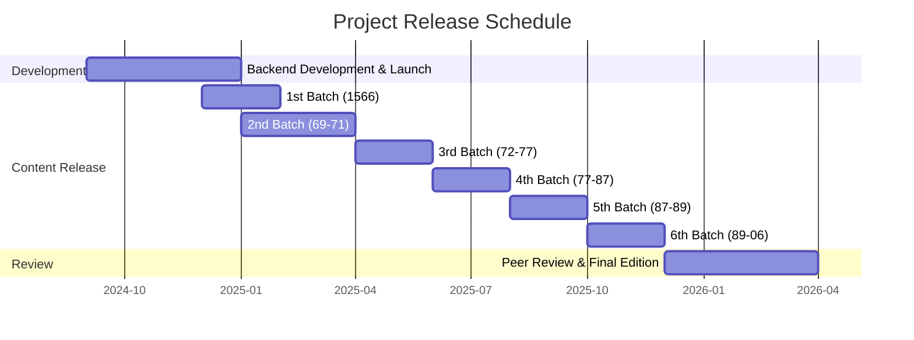

# Digital Edition of Filippo Cavriana's Correspondence

This project presents the first comprehensive digital edition of Filippo Cavriana's (1536-1606) correspondence, drawn from the *Mediceo del Principato* collection at the [State Archives of Florence](http://www.archiviodistato.firenze.it/), the *Archivio Gonzaga* in the [Archivio di Stato di Mantova](https://archiviodistatomantova.cultura.gov.it/), and the manuscript collection of the [Bibliothèque nationale de France](https://www.bnf.fr). 

As a physician at the court of France, and a spy for the grand dukes of Tuscany, Cavriana's letters provide crucial insights into the French Wars of Religion, the ideas, and the language of 16th-century politics.

## Citation

This edition represents thousands of hours of archival research, transcription, and encoding work. If you use these materials in your research, please cite this digital edition:

```
Godbarge, Clément. 2024. "Filippo Cavriana's Secret Correspondence (1563--1589)." St Andrews: University of St Andrews.
```

## Project Scope

The collection encompasses Cavriana's extensive correspondence network throughout Europe, providing crucial insights into late 16th-century diplomatic relations and the complex political landscape of Renaissance Italy and France.

## Technical Implementation

- Full TEI-XML encoding with semantic markup
- Named entity recognition and annotation
- Integration with Semantic Web standards
- Version-controlling and lifecylce management through GitHub
- Long-term storage on Zenodo

## Release Schedule

The project follows a phased release approach, with development and content publication spanning from late 2024 through early 2026.



## Access and Licensing

This work is licensed under a [Creative Commons Attribution 4.0 International License](http://creativecommons.org/licenses/by/4.0/). While the content is freely available, proper attribution is required for any use or adaptation of these materials.

## Contributing

To report issues or provide feedback, please submit an issue via GitHub or contact [Clément Godbarge](mailto:cag30@st-andrews.ac.uk) directly.

## Acknowledgments

This project has received support from the State Archives of Florence, the University of St Andrews, The Harvard University Center for Italian Renaissance Studies, and the Medici Archive Project.

---

**Note on Data Use**: This digital edition represents substantial scholarly work in transcription, annotation, and encoding. While we encourage its use for research, teaching, or data scraping, we ask that you acknowledge this contribution by citing the project appropriately in your work.
