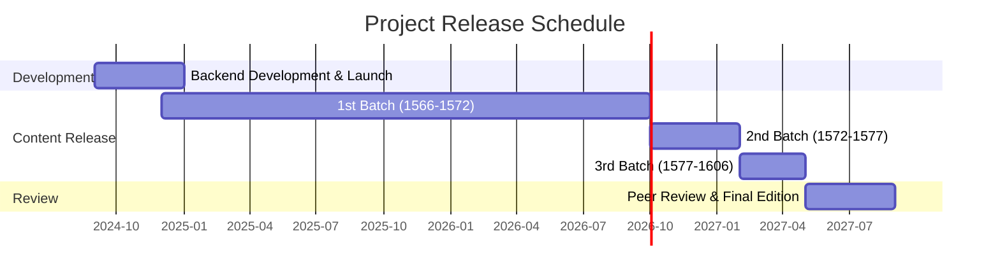

# Digital Edition of Filippo Cavriana's Correspondence
[](https://doi.org/10.5281/zenodo.8224585)
[](https://creativecommons.org/licenses/by/4.0/)  

[](https://github.com/Pantagrueliste/CavrianaCorr/actions/workflows/tei-validation.yml)
[](https://github.com/Pantagrueliste/CavrianaCorr_FrontEnd/actions/workflows/main.yml)


This project presents the first comprehensive digital edition of Filippo Cavriana's (1536-1606) correspondence, drawn from the *Mediceo del Principato* collection at the [State Archives of Florence](http://www.archiviodistato.firenze.it/), the *Archivio Gonzaga* in the [Archivio di Stato di Mantova](https://archiviodistatomantova.cultura.gov.it/), and the manuscript collection of the [Bibliothèque nationale de France](https://www.bnf.fr). 

As a physician at the court of France, and a spy for the grand dukes of Tuscany, Cavriana's letters provide crucial insights into the French Wars of Religion, the ideas, and the language of 16th-century European politics.

## Citation

This edition represents thousands of hours of archival research, transcription, and encoding work. If you use these materials in your research, please cite this digital edition using its concept DOI, which always resolves to the latest version:

```markdown
Clément Godbarge (ed.). *Filippo Cavriana: The Secret Correspondence*. Zenodo. https://doi.org/10.5281/zenodo.8224585.
```

To cite the specific version used, replace the concept DOI with the version DOI listed on Zenodo (e.g. v0.1.0-alpha: https://doi.org/10.5281/zenodo.14789457).

## Project Scope

The collection encompasses Cavriana's extensive correspondence network throughout Europe, providing crucial insights into late 16th-century diplomatic relations and the complex political landscape of Renaissance Italy and France.

## Technical Implementation

- Full TEI-XML encoding with semantic markup
- Named entity recognition and annotation
- Interactive data visualizations
- Integration with Semantic Web standards
- Version control and lifecycle management through GitHub
- Long-term storage on Zenodo

## Release Schedule

The project follows a phased release approach, with development and content publication spanning from late 2024 through mid-2027. Letters that are catalogued but not yet transcribed are kept as metadata-only placeholder stubs in this repository and withheld from the public site until transcription is complete.


```mermaid
gantt
    title Project Release Schedule
    dateFormat YYYY-MM
    axisFormat %Y-%m

    section Development
    Backend Development & Launch :2024-09, 2025-01

    section Content Release
    1st Batch (1566-1572)       :2024-12, 2026-10
    2nd Batch (1572-1577)       :2026-10, 2027-02
    3rd Batch (1577-1606)       :2027-02, 2027-05

    section Review
    Peer Review & Final Edition  :2027-05, 2027-09
```

## Access and Licensing

This work is licensed under a [Creative Commons Attribution 4.0 International License](https://creativecommons.org/licenses/by/4.0/) (see [LICENSE](LICENSE)). While the content is freely available, proper attribution is required for any use or adaptation of these materials. The code of the companion website lives in [CavrianaCorr_FrontEnd](https://github.com/Pantagrueliste/CavrianaCorr_FrontEnd) and is licensed separately (MIT).

## Visualizations

The project includes several visualizations to help explore Cavriana's correspondence:

- **Letter Heatmap Calendar**: A calendar heatmap showing Cavriana's letter-writing activity over time, with color intensity representing text volume (word count). See [docs/heatmap_README.md](docs/heatmap_README.md) for how it is generated, and [docs/rarechar.md](docs/rarechar.md) for the transcriber's cheat-sheet of rare characters and cipher markup.

## Contributing

To report issues or provide feedback, please submit an issue via GitHub or contact [Clément Godbarge](mailto:cag437@nyu.edu) directly.

## Acknowledgments

This project has received support from the State Archives of Florence, the University of St Andrews, The Harvard University Center for Italian Renaissance Studies, and the Medici Archive Project.

## Note on AI-Assisted Tooling

This edition also serves as an experimentation ground for new AI tools applied to Digital Humanities. Part of the encoding workflow relies on AI-assisted processes, including validation and transformation pipelines built with [tei-mcp](https://github.com/Pantagrueliste/tei-mcp), a Model Context Protocol server that exposes the TEI P5 specification to AI coding assistants. All AI-generated outputs are reviewed and corrected by the editor. Scholarly responsibility for the content of this edition remains entirely with the editor.

---

**Note on Data Use**: This digital edition represents substantial scholarly work in transcription, annotation, and encoding. While we encourage its use for research, teaching, or data scraping, we ask that you acknowledge this contribution by citing the project appropriately in your work.
